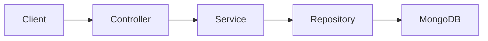
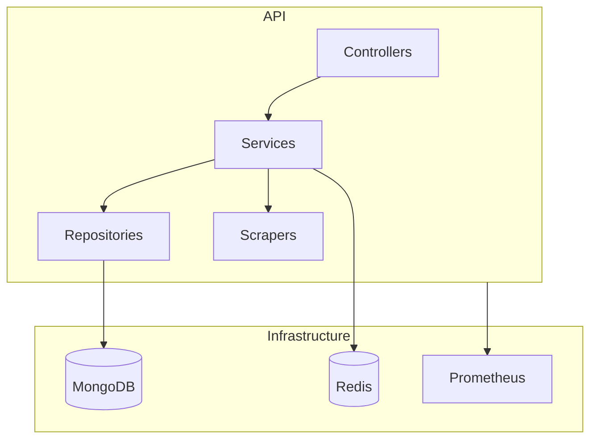

# Guide de l'Architecture

## Vue d'ensemble

L'API SCPArchive est construite suivant une architecture en couches (layered architecture) avec les composants suivants :

### Couches principales

1. **Présentation (Controllers)**
   - Gestion des endpoints REST
   - Versioning API
   - Documentation OpenAPI/Swagger
   - Validation des requêtes

2. **Logique métier (Services)**
   - Orchestration des opérations
   - Règles métier
   - Transformation des données

3. **Accès aux données (Repositories)**
   - Abstraction de la base de données
   - Requêtes MongoDB
   - Gestion du cache

4. **Infrastructure transverse**
   - Logging
   - Authentication/Authorization
   - Rate limiting
   - Monitoring

## Diagrammes

### Flux de données

### Architecture des composants

## Principes de conception

- SOLID
- Clean Architecture
- DDD (Domain-Driven Design)
- RESTful API best practices
